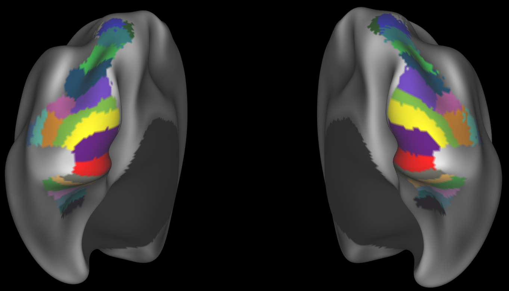

# wang2015-surface

Visual topography atlas from [Wang et al., 2015](https://academic.oup.com/cercor/article/25/10/3911/393661), converted/resampled from fsaverage to HCP fsLR 32k, both gifti and cifti

Initial FreeSurfer `.mgz` surfaces were copied from [nben/occipital_atlas](https://hub.docker.com/r/nben/occipital_atlas) (container location: `/opt/freesurfer/subjects/fsaverage/surf`) prior to resampling and conversion to cifti (fsLR 32k space) with Connectome Workbench

